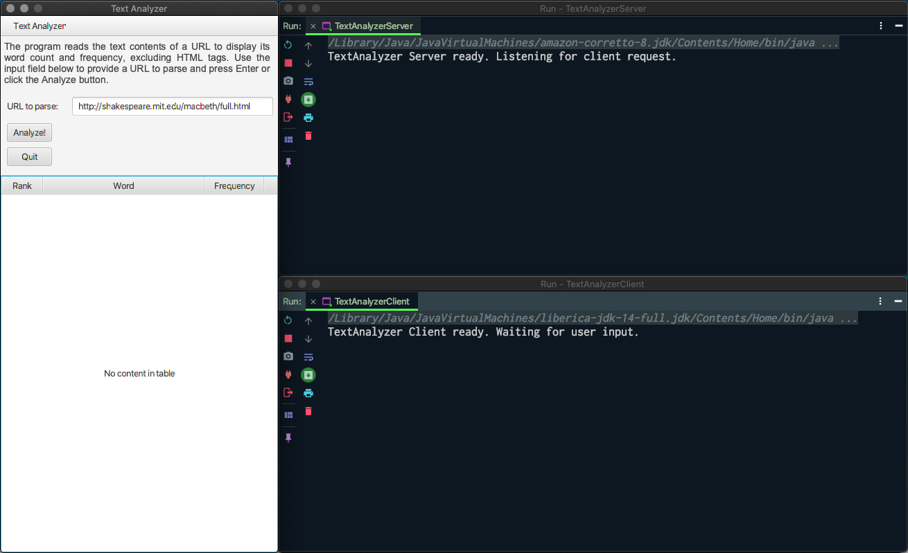
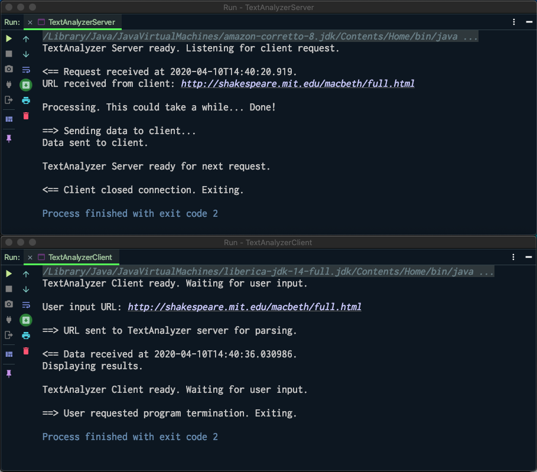
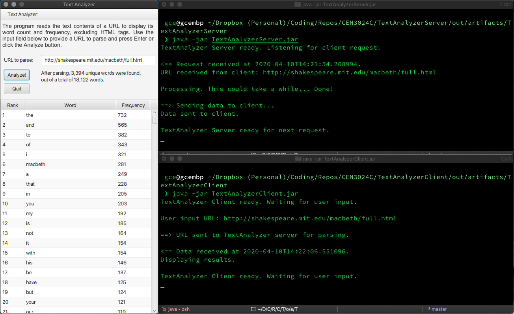
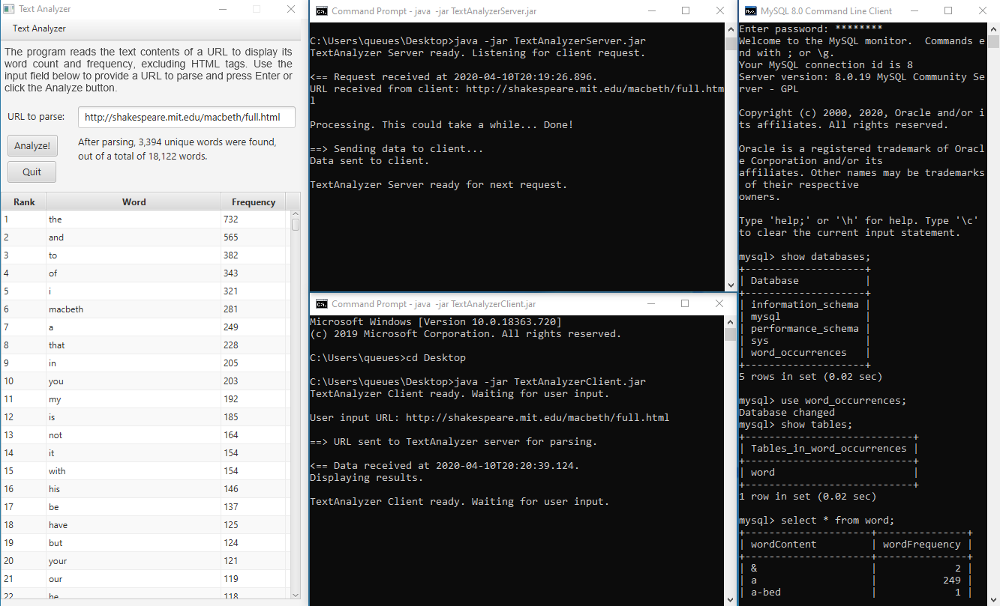

# TextAnalyzer Client
Go to [TextAnalyzer Server](https://github.com/qstainless/TextAnalyzerServer).

## Overview
This is the client application of my [TextAnalyzer](https://github.com/qstainless/TextAnalyzer) program. It uses a GUI (Graphical User Interface) that prompts the user to specify a URL (Uniform Resource Locator or website address) from which a file will be read and displays statistics about the words in that file, excluding HTML (HyperText Markup Language) tags.

## What does this program do?
The client presents a GUI to the user, asking for a URL to parse: count the total number of words, excluding HTML tags, the total number of unique words, and the frequency of those unique words. The client sends the URL to the server application, which will parse the URL and send back the statistics to this client application. Once the data is received, the client will display the statistics and the word/frequency pairs in the GUI, ordered by word frequency in descending order. 

## Code design
For this exercise, the [TextAnalyzer](https://github.com/qstainless/TextAnalyzer) program was split into two parts: this client application and a server application. The client application presents the user with the GUI, interacts with the server application to process the URL submitted by the user, and then displays the data processed and sent back by the server.

For additional code design notes, see the TextAnalyzer [Code Design](https://github.com/qstainless/TextAnalyzer#code-design) section.

## Test plans and standards
The client and server applications were built upon the existing TextAnalyzer code base. The program was not developed initially using TDD (Test Driven Development) standards. In other words, the code and expected output were not tested formally. Testing was done incrementally, that is, after each completed minor change, typically after each line of code was added, mainly to catch compile-time and runtime errors not previously detected and highlighted by the IDE.

As of version 1.7, the program includes unit tests created using Junit.

## System requirements
The client is a JavaFX application using version 8 of Amazon's distribution of the Open Java Development Kit (OpenJDK) [Corretto 8](https://aws.amazon.com/corretto/), which includes JavaFX 8. Unit tests were created using [Junit 5](https://github.com/junit-team/junit5/).

## How to use this program.
The client requires no user interaction other than compilation and execution. However, it must be run after the server application is running. 

The GUI consists of a single stage (window) and a single scene (window content). Although the scene's input field is pre-populated with the exercise's target URL, the user may specify the URL of a different file to parse. The results will appear in the TableVIew.

After the results are displayed, the user may enter the URL of another file for analysis.

Although the user may close the client application at any time, doing so will not terminate the server. To terminate both the client and the server, the user must enter "exit" (sans quotes) in the URL field and click the 'Analyze!' button.

## Installation.
Option 1. Clone the repo and import it in your favorite IDE. Make sure that:
 1. The project SDK is Java 8 with project language level 8, and
 2. JavaFX 8, Junit 5, [Jsoup](https://jsoup.org), and the Oracle [JDBC Driver](https://dev.mysql.com/downloads/connector/j/) for MySQL are installed in your system.

Option 2. Download and run [TextAnalyzerClient.jar](https://github.com/qstainless/TextAnalyzerClient/tree/master/out/artifacts/TextAnalyzerClient). 

IMPORTANT: You must run [TextAnalyzerServer](https://github.com/qstainless/TextAnalyzerServer) BEFORE you run this client.

## Known Issues
The server/client run from an IDE in macOS, Windows 10 Pro and Linux (Ubuntu 18.04). The client .jar file, however, only runs properly in macOS and Windows 10 Pro. Searching for a solution, Linux would require that Openjfx be installed alongside the JDK (in my case, Amazon Corretto 8). Unfortunately, installing Openjfx was not enough. I may revisit this in the future. 

Execution time was drastically different between macOS (~12s) and Windows 10 Pro (~73s). Because I don't typically develop in a Windows environment, I can't explain the difference. The [screenshot](#running-from-the-command-line-win10) shows the server and client timestamps and shows the schema and tables properly created. 

## Todo
Find a way to run the client .jar file in Linux.

## Version history
The version numbering of this project does not follow most version numbering guidelines. Instead, it is limited to a two-token concept:

```(major).(course module)``` 

```
Version 1.11 (current) - Converted program into server/client
Version 1.10 - Added database support
Version 1.9 - Added JavaDocs
Version 1.7 - Added unit tests using JUnit
Version 1.6 - Added GUI functionality
Version 1.2 - First version
```

## Screenshots
### Program running

### Displaying results

### Program termination

### Running from the command line (macOS)

### Running from the command line (Win10)


## Unit Tests

